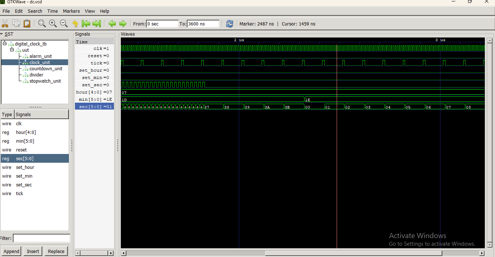

# 🕒 **Advanced Digital Clock System using Verilog:**

This project is a Digital Clock System designed using Verilog HDL and simulated using Icarus Verilog and GTKWave.

The project includes:

🕒 Digital Clock

⏱️ Stopwatch

⏳ Countdown Timer

🔔 Alarm

🔄 Mode Selection

⚡ Clock Divider

## 🛠️**Tools Used:**

Vivado

VS Code

Icarus Verilog

GTKWave

## 📌 **How the Project Works:**

The system uses a clock signal as the main input. A clock divider generates a slower tick signal, which is used to update the clock, stopwatch, and countdown timer.

The mode signal selects which function is shown on the display.

Mode	Function:

00	Digital Clock

01	Stopwatch

10	Countdown

## 🕒**Digital Clock:**

The digital clock keeps track of:

Hour : Minute : Second

The waveform shows the clock changing with every tick.

Waveform Explanation:

In GTKWave:

clk → main clock signal

tick → tells the clock when to update

clock_hour → hour value

clock_min → minute value

clock_sec → second value

When a tick occurs, the seconds increase. When seconds reach 59, they return to 00 and the minute increases.

📷 Digital Clock Waveform

## 🔔 **Alarm:**

The alarm compares the current clock time with the alarm time that we set.

For example:

Current Time = 07:30

Alarm Time = 07:30

When both match, the alarm signal becomes 1.

Waveform Explanation:

The waveform shows:

Current hour and minute

Set alarm hour and minute

alarm_enable

alarm

When the times match, the alarm signal becomes active.

📷 Alarm Waveform

## ⏱️ **Stopwatch:**

The stopwatch measures elapsed time.

When start_stop is activated, the stopwatch starts counting.

Example:

00:00:00 → 00:00:01 → 00:00:02 → 00:00:03

Pressing start_stop again stops the counting.

Waveform Explanation

In the waveform:

start_stop = 1 → stopwatch starts/stops

tick → timing signal

sw_sec → seconds

sw_min → minutes

sw_hour → hours

📷 Stopwatch Waveform

## ⏳ **Countdown Timer:**

The countdown timer starts from a value that we load.

For example, in my testbench:

00:00:05

After starting:

00:00:05 → 00:00:04 → 00:00:03 → 00:00:02 → 00:00:01 → 00:00:00

When it reaches zero, the done signal becomes 1.

Waveform Explanation

The important signals are:

load → loads the starting time

start → starts/stops the countdown

tick → decreases the timer

cd_sec → countdown seconds

done → indicates that countdown is finished

📷 Countdown Waveform

##🔄 **Mode Selection:**

The mode signal selects what is displayed.

mode = 00 → Digital Clock

mode = 01 → Stopwatch

mode = 10 → Countdown

## ⚡**Clock Divider:**

The clock divider generates the tick signal from the main clock.

The tick signal is then used by:

Digital Clock

Stopwatch

Countdown Timer

This makes the timing of all three modules easier to control.

📷 Clock Divider Waveform

## 🧪 **Simulation:**

I used a Verilog testbench to test the complete system.

The testbench checks:

Digital clock setting

Alarm setting

Stopwatch start/stop

Countdown loading

Countdown start

Mode selection

The signals were observed using GTKWave.

## 🎯 **Learning Outcomes:**

Through this project, I gained practical experience in:

Verilog HDL coding

RTL design

Modular design

Counters and clock division

Finite-state/control logic

Testbench development

Simulation and waveform analysis

Debugging Verilog designs

Using GTKWave for signal verification

GitHub project documentation

## **🧩 Project Architecture:**

The project is divided into multiple Verilog modules:

Advanced Digital Clock

├── dc_clock_divider.v

├── digital_clk.v

├── dc_alarm.v

├── dc_stopwatch.v

├── dc_countdown.v

├── dc_digital_clk_top.v

└── dc_tb.v

This project helped me understand how different digital modules can be combined into one system and how waveforms can be used to verify whether the hardware logic is working correctly.

Designed in Verilog. Simulated in Icarus Verilog. Debugged in GTKWave. 💻⚡

## 👩‍💻 **Author:**

Munthaj Ameena Sayyed

Electrical Engineering Student

Aspiring Digital RTL Design & Verification Engineer

